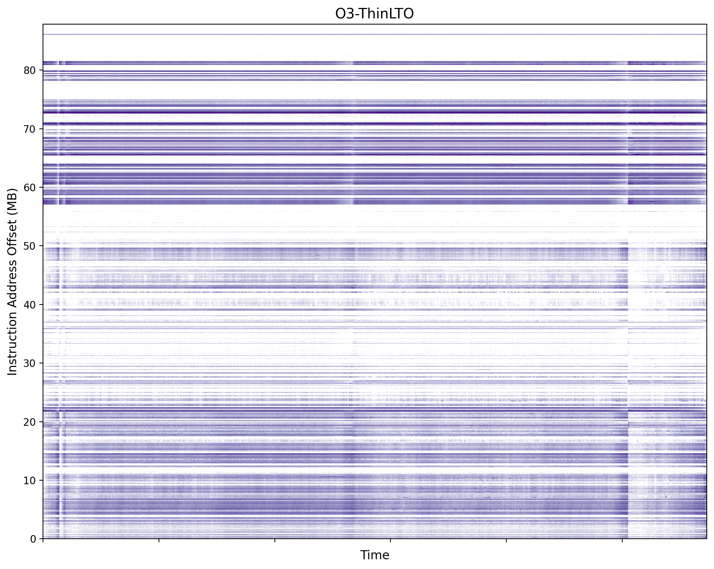
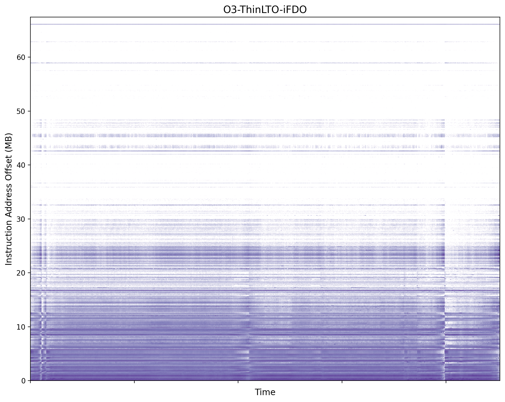
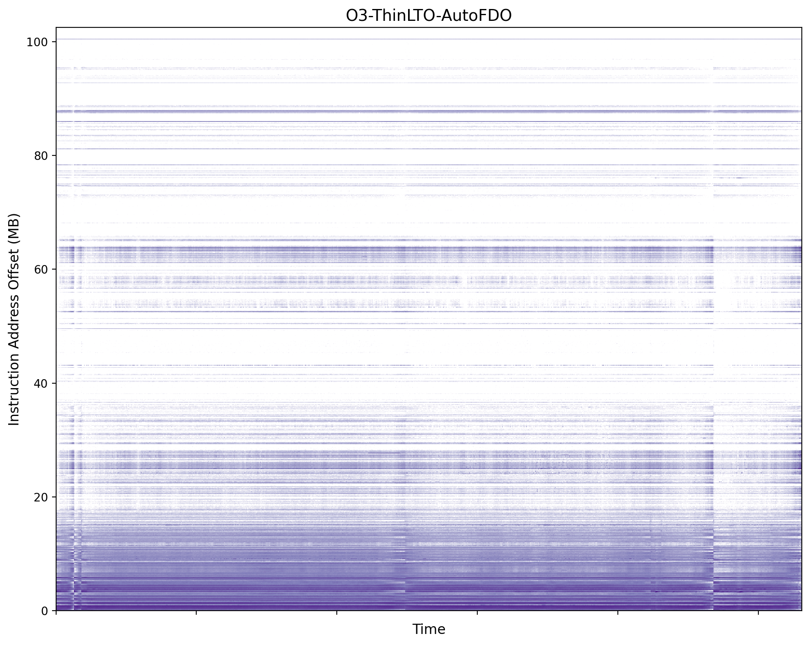
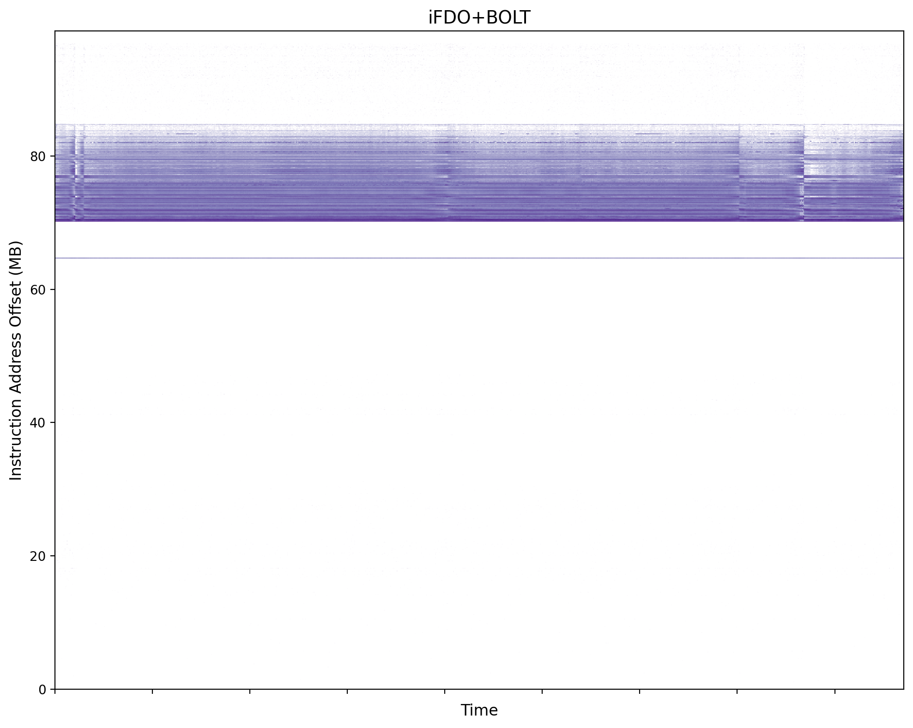
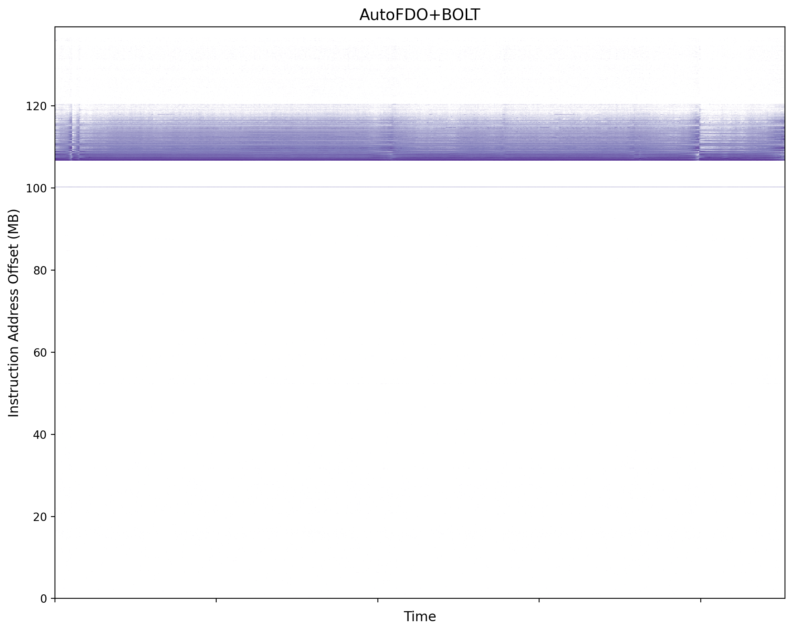
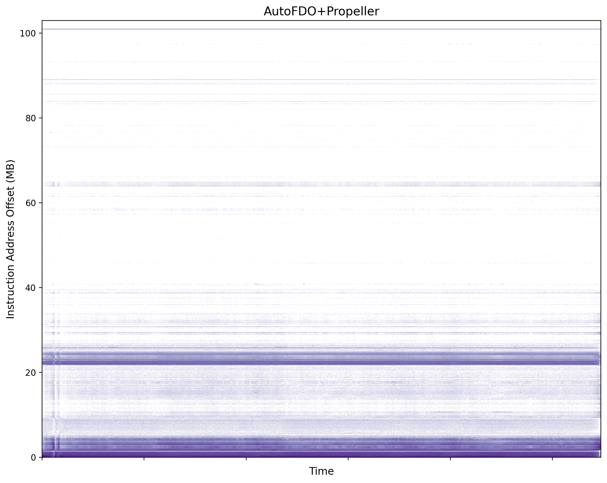

# *Draft:* Exploring & experimenting with PGO-LTO-PLTO

The idea of this blog is not to go super deep into each compiler optimization
technique, but to build intuition and experiment with them. If you feel like I
am skipping detailed explanations, that is on purpose, so please check out the
cited references.

The details regarding the experimental setup are towards the end of the blog.

## How it all started

It all started when I was downloading CachyOS to run some `sched_ext`[1]
experiments. While the OS was downloading, I looked into one of their published
blogs—"CachyOS Recap 2026 and Merry Christmas"[2]. One thing that caught my eye
was a feature they had recently introduced:

```
Optimization: The default kernel (linux-cachyos) is now optimized using
Propeller in conjunction with AutoFDO. This combination results is approximately
a 10% throughput improvement and reduced latency, depending on the workload.
```

The performance improvements look insane. So now the questions become - what
are AutoFDO and Propeller, when did the Linux kernel start to support them, and
which workloads did CachyOS people optimize? To answer the second question, I
found with a quick search that this was added to the Linux kernel build system
in 6.13[3] and is currently supported only by the Clang/LLVM compiler[4]. For
the third question, later in the process of writing this blog, I found that
CachyOS used their benchmarks to collect the profiling traces[11], but the
performance improvements are still a mystery.

Now, coming back to our first question what are AutoFDO & Propeller? I found a
self-explanatory presentation about Optimizing the Linux Kernel using AutoFDO &
Propeller[5]. I got introduced to new terms - FDO, iFDO, AutoFDO, BOLT &
Propeller. I was barely familiar with FDO/PGO (Feedback directed optimization/
Profile Guided optimization) earlier. We will explore what each of these terms
means and experiment with them.

This blog is a two-part series. In the first part, we will experiment and
benchmark these optimizations using Clang. Later, we will discuss them in the
context of the Linux kernel.

## Short Intro to Compiler, Linker & their Optimizations

For ppl who are not familiar with how modern compilers like LLVM work, this is
how I think about it. There are three layers - frontend, intermediate
representation, and backend. The frontend parses the source code (things like
lexer, parser, AST generation, semantic analysis, etc.) and generates an
intermediate representation. The IR stage is where a lot of compiler
optimizations are applied when you add flags like -O2/-O3. The backend
generates object files for the target architecture. 

After the compiler generates the object files, linker is responsible for
generating the binary. LLVM's linker (lld) offers LTO (Link Time Optimization)
and ThinLTO[7]. LTO works differently from regular compilation. Instead of
optimizing individual object files, the compiler emits IR (bitcode) files which
the linker merges into one monolithic module. The optimizer then runs on this
combined IR — enabling cross-module inlining, dead code elimination, etc. —
before the backend generates the final object code and links it. As one can
imagine this is a memory intensive process. Fun fact I've done this in the past
to generate a callgraph for a subset of kernel functions[8] using `make
allyesconfig` and it exhausted 256 GB and a little bit of swap that we had on
those lab servers. To avoid this memory intensive approach people came up with
ThinLTO.

In ThinLTO[7], the compiler generates module summaries along with IR. The
linker performs a fast "thin link" using these summaries to figure out what
needs to be imported/exported across modules. Then each module is optimized
and compiled in parallel, only pulling in the cross-module info it needs.
When LTO/ThinLTO is used, backend object file generation and final binary
linking happen after this optimization step.

Now what if we could also optimize based on how the program binary actually
runs? That's where PGO comes in.

## Profile Guided Optimization/ Feedback Directed Optimization (PGO/ FDO)

The idea of PGO is to collect profiling data from a program at runtime and feed
it to the compiler to optimize code better (inlining, code layout
optimizations, etc.).

There are currently two ways to do FDO: iFDO and AutoFDO[9]. The difference is
how they profile/sample data. iFDO instruments the code to collect data, which
is why it is usually not used in production. The data is typically collected
using a simulated test workload. AutoFDO, on the other hand, utilizes Intel
LBR (Last Branch Records), which has lower overhead because CPUs log branch
data directly to model-specific registers (MSRs). In practice, this makes it
more production-friendly (check reference[6] for more details).

PGO helps the compiler make better optimization decisions which functions to
inline, which branches are hot (reorder basic blocks so the hot path falls
through, etc) — but it doesn't control *where* that code ends up in the final
binary. That's the problem PLTO solve.

## Post Link Time Optimization - BOLT and Propeller

There are two ways to optimizing binaries after linking - dynamic and static
optimizers. Dynamic optimizer rewrite code at runtime in memory. They can
handle dynamically generated and self-modifying code, but they carry runtime
overhead. Dynamic optimizers/ code injection is interesting if you are curious
read more about JIT. Static binary optimizers take a different approach, they
rewrite the static binary, ahead of execution. No runtime overhead, simpler
deployment. BOLT[15] is a static binary optimizer. 

BOLT reads the final linked binary, disassembles it, and reconstructs the control
flow graph for each function. Using sample-based profiles, it runs an
optimization pipeline that includes basic block reordering, function
reordering, hot/cold code splitting, and peephole optimizations — then rewrites
the binary with the new layout. BOLT does all of this in a single monolithic
pass - memory and time overhead grows quickly with binary size. 

Propeller[18] takes a different approach - instead of disassembling and
rewriting the binary, it relinks it. The compiler emits basic block metadata
alongside the object files, so hardware samples can be mapped to individual
basic blocks without disassembly. A profiling tool then maps the hardware
samples to basic blocks and computes an optimal ordering. This ordering is fed
back as layout hints — the compiler uses them to reorder blocks within each
function, and the linker uses them to place functions globally.

I tried to describe both BOLT and Propeller on a high-level. I probably skipped
some important that could help you to understand them better. So I would highly
recommend you to check the papers cited. I found optimizations like
fall-through and function splitting interesting in propeller paper so you might
enjoy it as well. 

## Discussion of Experiment results

*For raw data collected during experiments and commands used refer to
[experiment_results](https://github.com/sidchintamaneni/blog/blob/blog/pgo-lto-plto/pages/blogs/data/pgo-lto-plto/pgo-lto-plto-experiments.md)
file.*

First I'll go over the experimental setup. The server I have been working on
has an Azure Linux 3.0 OS with 6.18.5 hwe kernel and gcc compiler version
13.2.0 installed on it.

So to start with I've built a clang compiler version (22.1.2) with GCC. I've
tried building the compiler using all the available cpus but it continued to
exceed the 128GB of available memory on the system. So for all the experiments I've
reduced the cpu count to 192. For all the builds I've used -O2 optimized clang
compiler unless otherwise stated.

### Results of -O2, -O3, -O3-LTO and -O3-ThinLTO

I've started to build clang and lld with different variations of compiler
optimizations. Build results are pretty straight forward no surprises there.
Both iFDO and AutoFDO have some challenges as they include some intermediate
steps.

In the below table, the 'built with' row specifies which compiler was used for
each build and yes I've compiled -O2 compiler again with -O2 to maintain
consistency and compare the results with other builds. Btw these are just 
compiler builds with different optimizations. Benchmarking them comes a bit
later.

**Build results:**

| Metric               | -O2 (GCC) | -O2 (Clang) | -O3 (Clang) | -O3, LTO | -O3, ThinLTO |
|----------------------|-----------|-------------|-------------|----------|-------------|
| Built with           | gcc/g++  | O2-clang   | O2-clang   | O2-clang | O2-clang  |
| Build time (wall)    | 3m 4s    | 2m 8s      | 2m 7s      | 21m 29s | 11m 37s    |
| clang-22 binary size | 136M     | 121M       | 125M       | 138M    | 139M       |
| .text                | 82,769,981 | 68,258,815 | 73,173,247 | 90,727,949 | 90,303,327 |
| .rodata              | 10,939,520 | 11,619,752 | 11,635,640 | 11,933,428 | 11,930,600 |
| .data                | 62,520     | 50,120     | 50,120     | 33,480  | 33,528     |
| .bss                 | 646,472    | 506,714    | 506,714    | 506,608 | 506,778    |
| Function count (T+t) | 165,177    | 137,339    | 136,581    | 132,828 | 134,836    |

From -O2 to -O3, the binary size increased, which could be the result of
function inlining as you can see the function count decreased. The rest of the
data seems consistent with slight increase in .rodata.

With LTO, as we discussed earlier the build time increased from ~127
secs to 1289 secs (I didn't measure the memory consumption but I would expect
that to be high as well, probably will do it when running experiments on the
kernel). ThinLTO is much faster than LTO nearly half because it uses the
modules summaries at the IR stage to only fetch the modules which are required
to perform optimizations in parallel. The rest of data for both of these matches my
expectations. To this point more optimization means bigger binaries due to
function inlining and some more "unknown" optimizations resulting the binary
size to increase. 

Let's see how the benchmarking numbers look like - for all the benchmarks I've
built an -O2 clang compiler 5 times with different optimized binaries and
collected the wall time with an additional warmup step.

**Benchmarks:**

| Compiler | Run 1 | Run 2 | Run 3 | Run 4 | Run 5 | Avg | vs O2-clang |
|----------|-------|-------|-------|-------|-------|-----|-------------|
| O2-clang (baseline) | 124 | 124 | 123 | 123 | 123 | 123.4s | - |
| O3-clang | 123 | 124 | 124 | 124 | 124 | 123.8s | +0.3% |
| O3-LTO | 120 | 120 | 120 | 120 | 120 | 120.0s | -2.8% |
| O3-ThinLTO | 121 | 120 | 121 | 120 | 121 | 120.6s | -2.3% |

The numbers look clean. If you are thinking why -O3 didn't improve
performance — it could be because the extra optimizations target code paths
that are never touched during execution. In most codebases only 10% of the
code is executed most of the time.

Donald E Knuth in "Structured Programming with go to Statements"[12] quoted that
```
Programmers waste enormous amounts of time thinking about, or worrying about,
the speed of noncritical parts of their programs, and these attempts at
efficiency actually have a strong negative impact when debugging and
maintenance are considered. We should forget about small efficiencies, say
about 97% of the time: pre-mature optimization is the root of all evil.

Yet we should not pass up our opportunities in that critical 3%.
```

This 3% is what PGO/ PLTO is trying to solve from the compilers perspective.
But how does the compiler know during build time about the critical areas in
the programs? that is where profiling/ sampling comes in.

### Results of iFDO and AutoFDO

Both iFDO and AutoFDO include additional build steps.

First for iFDO, we have to do an instrumented build of -O2 compiler with
compiler-rt support. Then the instrumented build is used to build -O3+ThinLTO
compiler to collect profiles. In the final stage these profiles are used to
build a -O3-ThinLTO-iFDO compiler.

**iFDO Intermediate Stats**

| Step | Wall time | Details |
|------|-----------|---------|
| Instrumented build (O2 + compiler-rt) | 2m 50s | 213M binary, 171,633 functions, .text: 100,613,282 |
| Profile workload (O3+ThinLTO compile) | 84m 5s | Instrumented clang ~40x slower |
| Profile merge | 23m 12s | 4,229 .profraw files (112 GB) → 49M merged.profdata |

As we discussed earlier while running the profile workload it took ~84 mins to
finish the build. That is why iFDO is not used in production to collect the
profiles.

For AutoFDO, we have similar stages. Instead of building an instrumented binary
we rely on LBR (last branch records)[6] a h/w level feature to collect runtime
profiles. AMD CPUs also support a similar feature.

**AutoFDO Intermediate Stats**

| Step | Wall time | Details |
|------|-----------|---------|
| Debug build (O3+ThinLTO + -gmlt + -fdebug-info-for-profiling) | 13m 16s | 511M binary, 131,840 functions |
| Perf workload (full build, -c 50009, -j1) | ~2h | ~110 GB perf.data, 13,376 functions captured, 4.66B total count |
| llvm-profgen conversion | 20m 16s | 34M autofdo.profdata, no warnings |
| Final build (O3+ThinLTO+AutoFDO) | 19m 59s | 149M binary, 119,584 functions |

I have to rebuild the O3+ThinLTO build to add `-gmlt` and
`-fdebug-info-for-profiling` flags, which are critical in mapping back the
profiling data collected during the build. I find building the binary a bit
painful because I had a hard time finding out the documentation, I found
someone else has a similar opinion as me [13]. 

Second step nearly took 2 hours because I ran the entire compiler build on a
single cpu to collect traces. I tried doing it on multiple CPUs but the
collected traces are sparse and results of the final output were not good. I
later tried `-j48` with the same `-c 50009` period and it finished in 4m 40s,
and the benchmarking results were same as what I collected with `-j1`. I also
tried lowering the `-c` period to increase sampling rate, but the perf.data
kept filling up my disk so I gave up.

For specific commands that are used during these intermediate stages, refer to
the document cited at the start of this section.

**Build Results of iFDO and AutoFDO:**

| Metric               | -O3, ThinLTO (base) | -O3, ThinLTO, iFDO | -O3, ThinLTO, AutoFDO |
|----------------------|---------------------|--------------------|-----------------------|
| Build time (wall)    | 11m 37s             | 9m 51s             | 19m 59s               |
| clang-22 binary size | 139M                | 123M               | 149M                  |
| .text                | 90,303,327          | 69,345,502         | 105,372,911           |
| .rodata              | 11,930,600          | 11,703,184         | 12,076,680            |
| .data                | 33,528              | 33,528             | 33,528                |
| .bss                 | 506,778             | 506,714            | 506,762               |
| Function count (T+t) | 134,836             | 157,289            | 119,584               |

My theory that more optimization results in increase in binary size was broken
with iFDO. Since compiler itself instrumented the binary to collect the
profiles, it identified the functions which are accessed frequently and inline
them ignoring the cold functions. For AutoFDO, probably because of poor
profiling quality there is aggressive inlining of functions which resulted in
decrease in function count and increase in binary size.

Let's see how benchmarking numbers look. This time along with wall clock time let's take
a closer look at perf stats and heatmap of instruction offset access.

**Benchmarks:**

| Compiler | Run 1 | Run 2 | Run 3 | Run 4 | Run 5 | Avg | vs O2-clang |
|----------|-------|-------|-------|-------|-------|-----|-------------|
| O2-clang (baseline) | 124 | 124 | 123 | 123 | 123 | 123.4s | - |
| O3-ThinLTO-iFDO | 98 | 98 | 97 | 99 | 99 | 98.2s | **-20.4%** |
| O3-ThinLTO-AutoFDO | 113 | 113 | 113 | 113 | 113 | 113.0s | **-8.4%** |

*Even though we have seen some perf improvement AutoFDO compared to LTO, it
should have performed similar to iFDO. Better profiling metric and iterative
profiling approach provided in AutoFDO paper[9] could've yielded some better
results*

**Perf stats results:**

| Metric | O2-clang | O3-clang | O3-LTO | O3-ThinLTO | O3-ThinLTO-iFDO | O3-ThinLTO-AutoFDO |
|--------|----------|----------|--------|------------|-----------------|-------------------|
| Instructions (T) | 43,826 | 43,386 | 40,208 | 40,450 | 32,540 | 37,068 |
| Cycles (T) | 54,126 | 54,051 | 52,451 | 52,761 | 41,847 | 48,961 |
| IPC | 0.81 | 0.80 | 0.77 | 0.77 | 0.78 | 0.76 |
| L1-icache misses (T) | 2,849 | 2,857 | 2,746 | 2,759 | 1,632 | 2,276 |
| iTLB misses (B) | 21.3 | 22.4 | 22.4 | 24.0 | 17.5 | 20.2 |
| Wall time | 125.1s | 124.6s | 121.1s | 121.8s | 99.1s | 114.5s |
| vs O2-clang | - | -0.4% | -3.2% | -2.6% | **-20.8%** | **-8.5%** |

As you can see icache, iTLB misses have dropped for PGO techniques compared to
the rest. IPC stays roughly the same across all builds (~0.76–0.81), so
performance is driven by instruction count - fewer instructions means fewer
cycles.

**Heat Map:**

<table><tr>
<td></td>
<td></td>
<td></td>
</tr></table>

*To refer the heatmap of all the builds checkout this [link](https://github.com/sidchintamaneni/blog/tree/blog/pgo-lto-plto/pages/blogs/data/pgo-lto-plto/heatmaps)*

These figures show the instruction offset access in each of these binaries. As
you can see, for iFDO and AutoFDO text instructions are arranged closer in the
binary, resulting in fewer icache misses compared to ThinLTO where the accesses
are spread all over.

### Results of BOLT and Propeller

Both BOLT and Propeller are usually applied on top of -O{2,3}, {Thin}LTO & PGO
(iFDO/ AutoFDO).

As described earlier, BOLT is applied directly on the binary. Whereas
Propeller layout hints are applied during code generation and linking.

### BOLT on iFDO and AutoFDO

| Metric | O3-ThinLTO-iFDO + BOLT | O3-ThinLTO-AutoFDO + BOLT |
|--------|------------|----------------|
| perf2bolt time | 4m 40s | 4m 41s |
| perf2bolt: functions profiled | 20,388 / 159,749 (12.8%) | 18,782 / 122,046 (15.4%) |
| bolt time | 26s | 29s |
| bolt: blocks reordered | 12,237 functions (60.0% of profiled) | 13,744 functions (73.2% of profiled) |
| bolt: hot/cold split | 8.7M hot / 12.4M cold (41.1% hot) | 9.4M hot / 16.8M cold (35.8% hot) |
| bolt: taken branches | -29.8% | -62.2% |
| bolt: taken forward branches | -51.5% | -79.2% |
| bolt: unconditional branches | -35.0% | -60.6% |
| bolt: instructions | -0.5% | -1.0% |
| clang-22 binary size | 169M | 198M |
| .text (hot) | 15,404,322 | 14,323,701 |
| .bolt.org.text (cold) | 69,345,502 | 105,372,911 |

BOLT barely changes the instructions (-0.5 to -1%), but dramatically improves
how they execute — fewer taken branches, better cache locality, hot code in
fewer pages. 

### Propeller on AutoFDO

| Metric | O3-ThinLTO-AutoFDO + Propeller |
|--------|-------------------------------|
| O3+ThinLTO+AutoFDO+labels build time | 20m 27s |
| .llvm_bb_addr_map size | 27.6M |
| Perf profile (100 cmds, sequential) | 135M perf.data, 173K samples |
| create_llvm_prof time | 3.4s |
| Hot functions profiled | 12,285 |
| Hot basic blocks | 268,754 |
| CFG nodes created | 1,154,578 |
| Edges created | 369,255 |
| Inter-function ext-tsp score | +201.8% |
| Intra-function ext-tsp score | +37.0% |
| cluster.txt lines | 24,433 |
| symorder.txt lines | 23,425 |
| Final build time | 18m 31s |
| clang-22 binary size | 153M |
| .text | 105,889,327 |
| .rodata | 12,074,552 |
| Function count (T+t) | 129,421 |

Propeller requires an extra build step — first build with
-fbasic-block-address-map (20m 27s) to emit Basic Block[16] metadata (27.6M
.llvm_bb_addr_map section), then profile with perf (173K samples from 100
sequential compilations - much light weight than what we have done in AutoFDO),
convert to layout files via create_llvm_prof (3.4s), and finally rebuild with
the layout (18m 31s). Out of ~129K functions, only 12,285 (9.5%)
were hot, containing 268K hot basic blocks. create_llvm_prof uses the ext-tsp
algorithm to optimize layout — inter-function score improved +201.8% (hot
callers/callees placed adjacent) and intra-function +37.0% (hot BBs fall
through). The output is two files: cluster.txt (24K lines of BB reordering
within functions) and symorder.txt (23K lines of function ordering for the
linker).

I ignored iFDO because of the benchmarking results when I ran BOLT + AutoFDO.
Since AutoFDO is much preferred approach, I've ignored it.

Let's see how benchmarks, perf stats and heatmaps look like

**Benchmark results:**

| Compiler | Run 1 | Run 2 | Run 3 | Run 4 | Run 5 | Avg | vs O2-clang |
|----------|-------|-------|-------|-------|-------|-----|-------------|
| O2-clang (baseline) | 124 | 124 | 123 | 123 | 123 | 123.4s | - |
| O3-ThinLTO-iFDO+BOLT | 95 | 95 | 95 | 95 | 95 | 95.0s | **-23.0%** |
| O3-ThinLTO-AutoFDO+BOLT | 98 | 97 | 97 | 98 | 98 | 97.6s | **-20.9%** |
| O3-ThinLTO-AutoFDO+Propeller | 97 | 98 | 97 | 98 | 97 | 97.4s | **-21.1%** |

iFDO+BOLT is the fastest at 95.0s (-23.0%). But AutoFDO went from -8.4% to
-20.9% with BOLT and -21.1% with Propeller. Code layout optimization basically
recovered what AutoFDO lost from poor profiling quality.

**Perf stats:**

| Metric | O3-ThinLTO-iFDO | O3-ThinLTO-AutoFDO | iFDO+BOLT | AutoFDO+BOLT | AutoFDO+Propeller |
|--------|-----------------|-------------------|-----------|--------------|-------------------|
| Instructions (T) | 32,540 | 37,068 | 32,497 | 36,825 | 37,007 |
| Cycles (T) | 41,847 | 48,961 | 40,399 | 41,489 | 41,197 |
| IPC | 0.78 | 0.76 | 0.80 | **0.89** | **0.90** |
| L1-icache misses (T) | 1,632 | 2,276 | **1,513** | **1,625** | **1,580** |
| iTLB misses (B) | 17.5 | 20.2 | **13.8** | **10.5** | **11.3** |
| Wall time | 99.1s | 114.5s | **95.9s** | **98.5s** | **98.6s** |
| vs O2-clang | **-20.8%** | **-8.5%** | **-23.4%** | **-21.3%** | **-21.2%** |

Remember how IPC was flat (~0.76–0.78) across PGO builds? With BOLT and
Propeller on AutoFDO it jumps to 0.89–0.90. Instructions barely changed but
cycles dropped — the CPU is just executing the same work more efficiently.
There is a significant improvement in iTLB and icache misses as well.
Hot code fits in fewer pages now.

**Heat map:**

<table><tr>
<td></td>
<td></td>
<td></td>
</tr></table>

The heatmaps confirm what the perf stats show. Compare these to the earlier
ThinLTO/iFDO/AutoFDO heatmaps - BOLT and Propeller pack the hot instructions
into a much tighter region of the binary. 

## See you next time

In this blog, we've explored how LTO, PGO and PLTO optimizations improved the
performance of a binary. In the next part we will see how these optimizations
are applied to the Linux kernel (also a binary) and try to answer the question
we started with.

## References
- [1] <https://github.com/sched-ext/scx/tree/main>
- [2] <https://cachyos.org/blog/2025-christmas-new-year/>
- [3] <https://lore.kernel.org/all/20241102175115.1769468-1-xur@google.com/>
- [4] <https://discourse.llvm.org/t/optimizing-the-linux-kernel-with-autofdo-including-thinlto-and-propeller/79108>
- [5] <https://lpc.events/event/18/contributions/1922/attachments/1450/3084/AutoFDO%20&%20Propeller%20in%20LPC%202024.pdf>
- [6] <https://lwn.net/Articles/680985/>
- [7] <https://blog.llvm.org/2016/06/thinlto-scalable-and-incremental-lto.html>
- [8] <https://github.com/rosalab/callgraph_generatorV2>
- [9] <https://github.com/google/autofdo>
- [10] <https://github.com/llvm/llvm-test-suite/tree/main>
- [11] <https://github.com/CachyOS/cachyos-benchmarker/blob/master/kernel-autofdo.sh>
- [12] <https://dl.acm.org/doi/epdf/10.1145/356635.356640>
- [13] <https://eklitzke.org/fdebug-info-for-profiling>
- [14] <https://dl.acm.org/doi/epdf/10.1145/3575693.3575727>
- [15] <https://research.facebook.com/file/534990324471927/BOLT-A-Practical-Binary-Optimizer-for-Data-Centers-and-Beyond.pdf>
- [16] <https://en.wikipedia.org/wiki/Basic_block>

## Experimental Setup
```
> lscpu
Architecture:                x86_64
  CPU op-mode(s):            32-bit, 64-bit
  Address sizes:             46 bits physical, 57 bits virtual
  Byte Order:                Little Endian
CPU(s):                      208
  On-line CPU(s) list:       0-207
Vendor ID:                   GenuineIntel
  Model name:                Intel(R) Xeon(R) Platinum 8473C
    CPU family:              6
    Model:                   143
    Thread(s) per core:      2
    Core(s) per socket:      52
    Socket(s):               2
    Stepping:                8
    CPU(s) scaling MHz:      31%
    CPU max MHz:             3800.0000
    CPU min MHz:             800.0000
    BogoMIPS:                4200.00

Caches (sum of all):         
  L1d:                       4.9 MiB (104 instances)
  L1i:                       3.3 MiB (104 instances)
  L2:                        208 MiB (104 instances)
  L3:                        210 MiB (2 instances)

> cat /etc/os-release 
  NAME="Microsoft Azure Linux"
  VERSION="3.0.20260304"
  ID=azurelinux
  VERSION_ID="3.0"
  PRETTY_NAME="Microsoft Azure Linux 3.0"
  ANSI_COLOR="1;34"
  HOME_URL="https://aka.ms/azurelinux"
  BUG_REPORT_URL="https://aka.ms/azurelinux"
  SUPPORT_URL="https://aka.ms/azurelinux"

> uname -r
6.18.6-2-cachyos

> gcc --version
gcc (GCC) 13.2.0

# LLVM version used for experiments - 22.1.2 (`llvmorg-22.1.2`)
```
