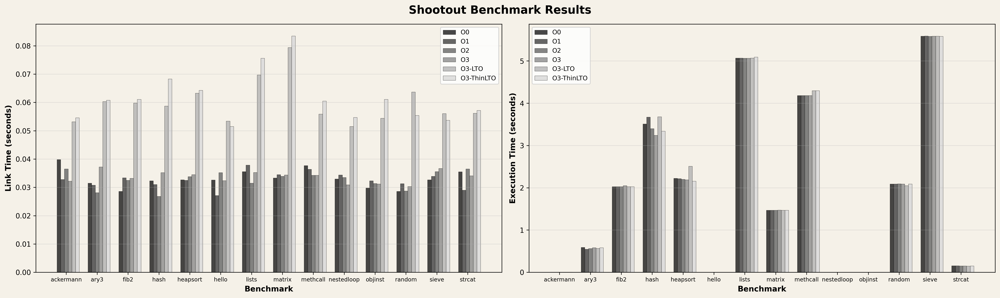

# Exploring & experimenting with PGO-LTO-PLTO

The idea of this blog is not to go super deep into each compiler optimization
technique, but to form an abstract mental model and experiment with them. If
you feel like I am skipping detailed explanations, that is on purpose—please
check out the references.

The details regarding the experimental setup are towards the end of the blog.

## How it all started

It all started when I was downloading CachyOS to run some `sched_ext`[1]
experiments. While the OS was downloading, I looked into one of their published
blogs—"CachyOS Recap 2026 and Merry Christmas"[2]. One thing that caught my
eye was a feature they had recently introduced:

```
Optimization: The default kernel (linux-cachyos) is now optimized using
Propeller in conjunction with AutoFDO. This combination results is approximately
a 10% throughput improvement and reduced latency, depending on the workload.
```

The performance improvements look insane. So now the questions become - what are
AutoFDO and Propeller, when did the Linux kernel start to support them, and which
workloads did CachyOS people optimize? To answer the second question, I found
with a quick search that this was added to the Linux kernel build system in 6.13[3]
and is currently supported only by the Clang/LLVM compiler[4]. For the third question,
later in the process of writing this blog, I found that CachyOS used their
benchmarks to collect the profiling traces[11], but the performance improvements
are still a mystery.

Now, coming back to our first question what are AutoFDO & Propeller? I found a
self-explanatory presentation about Optimizing the Linux Kernel using AutoFDO &
Propeller[5]. I got introduced to new terms - FDO, iFDO, AutoFDO, BOLT &
Propeller. I was barely familiar with FDO/PGO (Feedback directed
optimization/ Profile Guided optimization). We will explore what each of these
terms means and experiment with them.

I am expecting this blog to be a two-part series. In the first part, we will run
and experiment with these optimizations using clang. Later, we will discuss them
in the context of the Linux kernel.

## Short Intro to Compiler, Linker & their Optimizations

For ppl who are not familiar with how modern compilers like LLVM work, this is
the mental model I formed. There are three layers - frontend, intermediate
representation, and backend. The frontend parses the source code (things like
lexer, parser, AST generation, semantic analysis, etc.) and generates an
intermediate representation. The IR stage is where a lot of compiler
optimizations are applied when you supply flags like -O2/-O3. The backend
generates object files for the target architecture. 

After compiler generates the object files, linker is responsible for generating
the binary. llvm linker (lld) offers LTO (link time optimization & Thin LTO)
[7].  LTO is not performed on the obj files generated by backend instead it get
all the IR files (bitcode files) and generates one monolithic file and then
perform the optimizations, later invokes backend and linker subsequently.  As
one can imagine this is a memory intensive process. Fun fact I've done this in
the past to generate a callgraph for subset of kernel functions[8] and we never
saw our lab servers using that much memory(It exhausted 256 GB and little bit of
swap that we had on those servers). To avoid this memory intensie approach ppl
have come up with ThinLTO.

In ThinLTO[7], the compiler generates module summaries along with IR. The
linker performs a fast "thin link" using these summaries to figure out what
needs to be imported/exported across modules. Then each module is optimized
and compiled in parallel, only pulling in the cross-module info it needs.
When LTO/ThinLTO is used, backend object file generation and final binary
linking happen after this optimization step.

Now what if we could also optimize based on how the program actually runs?
That's where PGO comes in.

## Profile Guided Optimization/ Feedback Directed Optimization (PGO/ FDO)

The idea of PGO is to collect profiling data from a program at runtime and feed
it to the compiler to optimize code better (inlining, code layout
optimizations, etc.).

There are currently two ways to do FDO: iFDO and AutoFDO[9]. The difference is
how they profile/sample data. iFDO instruments the code to collect data, which
is why it is usually not used in production; the data is typically collected
using a simulated test workload. AutoFDO, on the other hand, utilizes Intel
LBR (Last Branch Records), which has lower overhead because CPUs log branch
data directly to model-specific registers (MSRs). In practice, this makes it
more production-friendly (check reference[6] for more details).

Let's talk about PLTO, BOLT and Propeller a little later in the blog. For now
let's experiment with LTO and PGO.

# Experimenting with LTO & PGO

<!-- Stale

For this blog, I am chosing the exisiting benchmarks from llvm-test-suite[10],
especially the tests under SingleSource/ & MultiSource/.

First I am running tests under SingleSource/ with three levels of compiler
optimizations and LTO.

Reference command to run llvm-test-suite to run with different compiler flags
```
mkdir {somewhere}
cmake -G Ninja -DCMAKE_C_COMPILER=clang -DCMAKE_CXX_COMPILER=clang++ \
-DCMAKE_C_FLAGS="-O0" -DCMAKE_CXX_FLAGS="-O0" -DCMAKE_BUILD_TYPE=Release \
-DTEST_SUITE_SUBDIRS="SingleSource" -DTEST_SUITE_RUN_BENCHMARKS=ON \
-DTEST_SUITE_BENCHMARKING_ONLY=ON $SUITE_DIR

ninja -j `nproc`

lit -v -j1 -o {file_name} SingleSource/Benchmarks/Shootout
```
I am trying to understand the results from SingleSource/Benchmarks/Shootout
folder since they are a bit easier to comprehend.

link to raw data: <hyperlink to experiment 1 rawdata table>



Compile times are ~zero. Execution times shows minimal differences except for
hash test. Link times are intersting since we can clearly see the time has
increased by enabling LTO. In most tests ThinLTO shows more overhead than LTO.
so it's not worth it to go fancy with basic tests.

Rusults from running benchmarks under MultiSource not interesting.
-->


# References
[1] https://github.com/sched-ext/scx/tree/main  
[2] https://cachyos.org/blog/2025-christmas-new-year/  
[3] https://lore.kernel.org/all/20241102175115.1769468-1-xur@google.com/  
[4] https://discourse.llvm.org/t/optimizing-the-linux-kernel-with-autofdo-including-thinlto-and-propeller/79108  
[5] https://lpc.events/event/18/contributions/1922/attachments/1450/3084/AutoFDO%20&%20Propeller%20in%20LPC%202024.pdf  
<!--Reference to LBR (last branch records) -->  
[6] https://lwn.net/Articles/680985/  
[7] https://blog.llvm.org/2016/06/thinlto-scalable-and-incremental-lto.html  
[8] https://github.com/rosalab/callgraph_generatorV2  
[9] https://github.com/google/autofdo  
[10] https://github.com/llvm/llvm-test-suite/tree/main  
[11] https://github.com/CachyOS/cachyos-benchmarker/blob/master/kernel-autofdo.sh

## Experimental Setup
```
> lscpu
Vendor ID:                   GenuineIntel
  Model name:                Intel(R) Core(TM) i7-8700T CPU @ 2.40GHz
    CPU family:              6
    Model:                   158
    Thread(s) per core:      1
    Core(s) per socket:      6
    Socket(s):               1
    Stepping:                10
    CPU(s) scaling MHz:      33%
    CPU max MHz:             2400.0000
    CPU min MHz:             800.0000
Caches (sum of all):
  L1d:                       192 KiB (6 instances)
  L1i:                       192 KiB (6 instances)
  L2:                        1.5 MiB (6 instances)
  L3:                        12 MiB (1 instance)

> cat /etc/os-release
NAME="CachyOS Linux"
PRETTY_NAME="CachyOS"
ID=cachyos
BUILD_ID=rolling // live life dangerously

> uname -r
6.18.6-2-cachyos

❯ clang --version
clang version 21.1.6
Target: x86_64-pc-linux-gnu
Thread model: posix
InstalledDir: /usr/bin

❯ llvm-config --version
21.1.6
```
